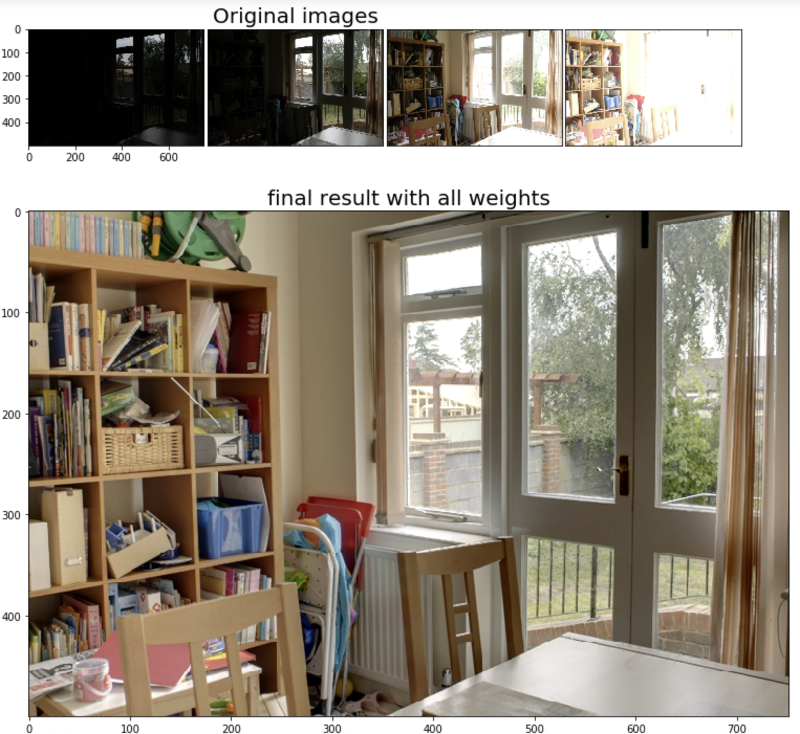
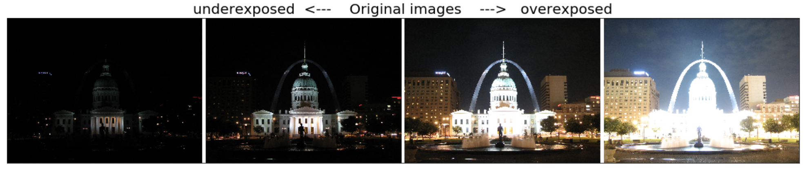

# Basic techniques on image processing 
##  1. Explored 4 types of image blurring methods
      1. Average 
      2. Median 
      3. Gaussian 
      4. Bilateral filter 

## 2. Implemented image blending using image pyramid methods
      - Gaussian Pyramid
      - Laplacian Pyramid

#  Exposure fusion   

## 1. Multiresolution blending using OpenCV in Python 

This notebook implements exposure fusion, which was introduced by Merten et al. 
This picture shows the result of my implemention on exposure fusion. 
For details, please check **mergeMertens_fromScratches.ipynb**

## 2. High Dynamic Range radiance image fusion 

Tone-mapped image using Drago's method after the four images are merged into a single HDR radiance map 

